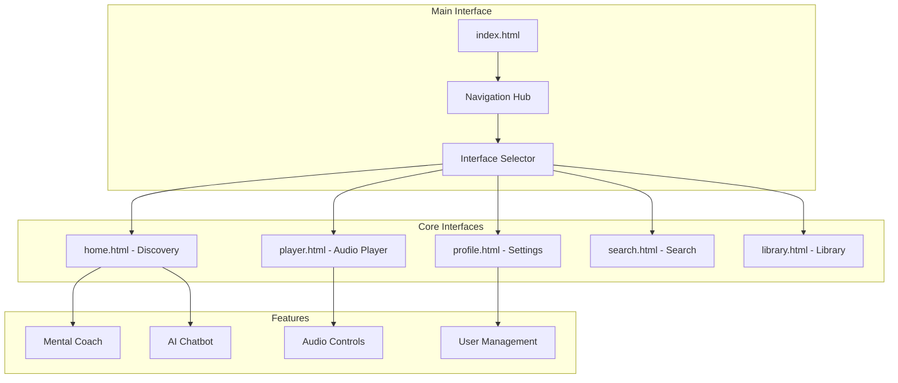

<div align="center"><a name="readme-top"></a>

[](#)

# 🎧 Podcast App Prototype<br/><h3>High-Fidelity Mental Wellness Podcast Experience</h3>

An innovative podcast application prototype that leverages modern UI/UX design to provide seamless audio experiences with integrated mental wellness features.<br/>
Supports AI-powered mental coaching, interactive chatbot assistance, and immersive player interface with iOS-compliant design patterns.<br/>
One-click **FREE** preview of your future podcast platform.

[Live Demo][demo-link] · [Documentation][docs] · [Issues][github-issues-link]

<br/>

[][demo-link]

<br/>

<!-- SHIELD GROUP -->

[![][github-release-shield]][github-release-link]
[![][vercel-shield]][vercel-link]
[![][discord-shield]][discord-link]<br/>
[![][github-contributors-shield]][github-contributors-link]
[![][github-forks-shield]][github-forks-link]
[![][github-stars-shield]][github-stars-link]
[![][github-issues-shield]][github-issues-link]
[![][github-license-shield]][github-license-link]<br>
[![][sponsor-shield]][sponsor-link]

**Share Podcast App Prototype**

[![][share-x-shield]][share-x-link]
[![][share-telegram-shield]][share-telegram-link]
[![][share-whatsapp-shield]][share-whatsapp-link]
[![][share-reddit-shield]][share-reddit-link]
[![][share-weibo-shield]][share-weibo-link]
[![][share-mastodon-shield]][share-mastodon-link]
[![][share-linkedin-shield]][share-linkedin-link]

<sup>🌟 Pioneering the future of podcast and mental wellness integration. Built for the next generation of mindful listeners.</sup>

[![][github-trending-shield]][github-trending-url]

## 📸 Project Screenshots

> [!TIP]
> Experience the modern podcast interface with integrated mental wellness features.

<div align="center">
  
  <p><em>Main Dashboard - Discovery feed with personalized recommendations</em></p>
</div>

<div align="center">
  
  
  <p><em>Key Features - Immersive Audio Player and AI Mental Coach</em></p>
</div>

<details>
<summary><kbd>📱 More Screenshots</kbd></summary>

<div align="center">
  
  <p><em>iPhone 15 Pro Optimized Design</em></p>
</div>

<div align="center">
  
  <p><em>Profile and Settings Interface</em></p>
</div>

</details>

## 🎬 Demo Video

> [!NOTE]
> Watch the interactive podcast prototype in action with smooth transitions and modern UI patterns.

<div align="center">

[](https://www.youtube.com/watch?v=[VIDEO_ID])

*Click the image above to watch the full demo video*

</div>

**Tech Stack Badges:**

<div align="center">

 
 
 
 
 

</div>

</div>

> [!IMPORTANT]
> This project demonstrates modern mobile-first design practices with iOS-compliant interface patterns. It combines cutting-edge UI/UX design with mental wellness features to provide an innovative podcast listening experience. Features include AI-powered mental coaching, interactive chatbot assistance, and immersive audio player interface.

<details>
<summary><kbd>📑 Table of Contents</kbd></summary>

#### TOC

- [🎧 Podcast App Prototype](#-podcast-app-prototype)
      - [TOC](#toc)
      - [](#)
  - [🌟 Introduction](#-introduction)
  - [✨ Key Features](#-key-features)
    - [`1` Immersive Audio Player](#1-immersive-audio-player)
    - [`2` AI Mental Coach](#2-ai-mental-coach)
    - [`*` Additional Features](#-additional-features)
  - [🛠️ Tech Stack](#️-tech-stack)
  - [🏗️ Architecture](#️-architecture)
    - [Interface Architecture](#interface-architecture)
    - [Component Structure](#component-structure)
  - [⚡️ Performance](#️-performance)
  - [🚀 Getting Started](#-getting-started)
    - [Prerequisites](#prerequisites)
    - [Quick Setup](#quick-setup)
    - [Development Mode](#development-mode)
  - [🛳 Deployment](#-deployment)
    - [`A` Static Hosting](#a-static-hosting)
    - [`B` Local Server](#b-local-server)
  - [📖 Usage Guide](#-usage-guide)
    - [Interface Navigation](#interface-navigation)
    - [Feature Overview](#feature-overview)
  - [🔌 Integrations](#-integrations)
  - [📦 Ecosystem](#-ecosystem)
  - [⌨️ Development](#️-development)
    - [Local Development](#local-development)
    - [Adding Features](#adding-features)
  - [🤝 Contributing](#-contributing)
    - [Development Process](#development-process)
    - [Contribution Guidelines](#contribution-guidelines)
  - [❤️ Sponsor](#️-sponsor)
  - [📄 License](#-license)
  - [👥 Team](#-team)

####

<br/>

</details>

## 🌟 Introduction

We are passionate developers creating next-generation podcast and mental wellness solutions. By adopting modern design practices and cutting-edge UI/UX technologies, we aim to provide users with powerful, immersive, and mindful audio experiences.

Whether you're a podcast enthusiast, mental wellness advocate, or UX/UI designer, this prototype will be your inspiration playground. Please note that this project is a high-fidelity prototype, and we welcome feedback for any [issues][issues-link] encountered.

> [!NOTE]
> - Modern web browser required for optimal viewing
> - iPhone 15 Pro dimensions (393×852px) optimized
> - Responsive design supports various screen sizes
> - No backend services required for prototype demonstration

|| [![][demo-shield-badge]][demo-link]   | No installation required! Visit our demo to experience the interface firsthand.                           |
|| :------------------------------------ | :--------------------------------------------------------------------------------------------- |
|| [![][discord-shield-badge]][discord-link] | Join our community! Connect with designers and podcast enthusiasts. |

> [!TIP]
> **⭐ Star us** to receive all release notifications from GitHub without delay!

[![][image-star]][github-stars-link]

<details>
  <summary><kbd>⭐ Star History</kbd></summary>
  <picture>
    <source media="(prefers-color-scheme: dark)" srcset="https://api.star-history.com/svg?repos=ChanMeng666%2Fpodcast-app-prototype&theme=dark&type=Date">
    
  </picture>
</details>

## ✨ Key Features

[![][image-feat-core]][docs-feat-core]

### `1` [Immersive Audio Player][docs-feat-core]

Experience next-generation podcast listening with our beautifully designed audio player. Our innovative approach provides unprecedented user engagement through advanced UI patterns and seamless interactions. This breakthrough feature delivers intuitive playback controls with iOS-native feel.

<div align="center">
  
  <p><em>Immersive Audio Player with Chapter Navigation</em></p>
</div>

Key capabilities include:
- 🎯 **Full-Screen Experience**: Immersive player interface with artwork display
- ⏭️ **Chapter Navigation**: Easy browsing through podcast segments
- ⚡ **Speed Controls**: Customizable playback speed options
- 🌙 **Sleep Timer**: Automatic playback stop functionality

[![][back-to-top]](#readme-top)

### `2` [AI Mental Coach][docs-feat-advanced]

Revolutionary mental wellness integration that transforms how users engage with mindfulness content. With our advanced AI coaching system and intuitive design, users can receive personalized mental health guidance while maintaining their podcast listening habits.

<div align="center">
  
  
  <p><em>AI Mental Coach (left) and Interactive Chatbot (right)</em></p>
</div>

**Available Features:**
- **Mental Coach**: Personalized wellness guidance and mood tracking
- **AI Chatbot**: Interactive assistant for queries and support

[![][back-to-top]](#readme-top)

### `*` Additional Features

Beyond the core features, this prototype includes:

- [x] 📱 **iOS-Compliant Design**: Native iPhone interface patterns and guidelines
- [x] 🎨 **Modern UI/UX**: Beautiful design with carefully crafted visual hierarchy
- [x] 🔍 **Discovery Feed**: Personalized podcast recommendations and featured content
- [x] 📚 **Library Management**: Organized content browsing and management
- [x] 👤 **Profile System**: User settings and preference management
- [x] 🎧 **Continue Listening**: Resume playback from where you left off
- [x] ⭐ **Rating System**: Podcast rating and review functionality
- [x] 📱 **Mobile-First**: Optimized for iPhone 15 Pro dimensions

> ✨ More features are continuously being designed as the prototype evolves.

<div align="right">

[![][back-to-top]](#readme-top)

</div>

## 🛠️ Tech Stack

<div align="center">
  <table>
    <tr>
      <td align="center" width="96">
        
        <br>HTML5
      </td>
      <td align="center" width="96">
        
        <br>Tailwind CSS
      </td>
      <td align="center" width="96">
        
        <br>JavaScript
      </td>
      <td align="center" width="96">
        
        <br>CSS3
      </td>
      <td align="center" width="96">
        
        <br>FontAwesome
      </td>
    </tr>
  </table>
</div>

**Frontend Stack:**
- **Markup**: HTML5 with semantic structure
- **Styling**: Tailwind CSS for utility-first design
- **Icons**: FontAwesome comprehensive icon library
- **Design System**: iOS-compliant interface patterns
- **Responsive**: Mobile-first responsive design

**Design & UX:**
- **Target Device**: iPhone 15 Pro (393×852px)
- **Design Guidelines**: Apple Human Interface Guidelines
- **Color Scheme**: Modern dark and light theme support
- **Typography**: System fonts optimized for readability
- **Accessibility**: Semantic HTML and proper contrast ratios

> [!TIP]
> Each technology was carefully selected for rapid prototyping, visual fidelity, and ease of demonstration.

## 🏗️ Architecture

### Interface Architecture

> [!TIP]
> This modular architecture supports easy navigation between different app screens and maintains consistent design patterns throughout the prototype.



### Component Structure

<div align="center">
  
  <p><em>Visual Architecture Overview</em></p>
</div>

```
podcast-app-prototype/
├── index.html              # Main prototype showcase
├── home.html               # Discovery interface
├── player.html             # Audio player interface
├── profile.html            # User profile & settings
├── search.html             # Search functionality
├── library.html            # Library management
├── assets/                 # Images and media
├── styles/                 # Custom CSS (if any)
└── README.md               # Documentation
```

## ⚡️ Performance

> [!NOTE]
> Complete performance analysis available for static prototype demonstration

### Performance Metrics

**Key Metrics:**
- ⚡ **Instant Loading**: Static HTML files load immediately
- 📱 **Mobile Optimized**: Designed specifically for iPhone 15 Pro
- 🎨 **Smooth Animations**: CSS transitions and hover effects
- 📊 **Lightweight**: Minimal resource footprint
- 🔄 **Fast Navigation**: Instant page transitions

**Optimization Features:**
- 🎯 **Tailwind CSS**: Utility-first CSS for minimal bundle size
- 📦 **FontAwesome**: Efficient icon delivery system
- 🖼️ **Optimized Images**: Compressed assets for fast loading
- 📱 **Mobile-First**: Optimized for touch interactions

## 🚀 Getting Started

### Prerequisites

> [!IMPORTANT]
> Ensure you have the following for optimal viewing:

- Modern web browser (Chrome, Safari, Firefox, Edge)
- Internet connection (for CDN resources)
- Screen resolution supporting mobile viewport simulation

### Quick Setup

**1. Clone Repository**

   ```bash
git clone https://github.com/ChanMeng666/podcast-app-prototype.git
   cd podcast-app-prototype
   ```

**2. Open in Browser**

```bash
# Open main prototype showcase
open index.html

# Or open specific interfaces directly
open home.html
open player.html
open profile.html
```

**3. Mobile Simulation (Recommended)**

For the best experience, use browser developer tools:
- Open Developer Tools (F12)
- Toggle device simulation
- Select iPhone 15 Pro or similar mobile device
- Set dimensions to 393×852px

🎉 **Success!** Explore the podcast app prototype interfaces!

### Development Mode

For local development with live reloading:

```bash
# Using Python's built-in server
python -m http.server 3000

# Using Node.js serve package
npx serve .

# Using PHP built-in server
php -S localhost:3000
```

## 🛳 Deployment

> [!IMPORTANT]
> Choose the deployment strategy that best fits your needs. Static hosting is recommended for prototype demonstration.

### `A` Static Hosting

**Vercel (Recommended)**

[](https://vercel.com/new/clone?repository-url=https%3A%2F%2Fgithub.com%2FChanMeng666%2Fpodcast-app-prototype)

**Manual Deployment:**

```bash
# Install Vercel CLI
npm i -g vercel

# Deploy
vercel --prod
```

**Other Platforms:**

<div align="center">

|           Deploy with Netlify            |                     Deploy with GitHub Pages                      |
| :-------------------------------------: | :---------------------------------------------------------: |
| [![][deploy-netlify-button]][deploy-netlify-link] | [![][deploy-github-button]][deploy-github-link] |

</div>

### `B` Local Server

```bash
# Python 3
python -m http.server 8000

# Python 2
python -m SimpleHTTPServer 8000

# Node.js
npx http-server

# PHP
php -S localhost:8000
```

Visit `http://localhost:8000` to view the prototype.

## 📖 Usage Guide

### Interface Navigation

**Getting Started:**

1. **Open Main Interface** via `index.html` to see all available screens
2. **Explore Individual Interfaces** by clicking navigation or opening files directly
3. **Test Mobile View** using browser developer tools device simulation
4. **Navigate Features** through interactive UI elements

#### Interface Walkthrough

<div align="center">
  
  <p><em>Main Prototype Interface Hub</em></p>
</div>

### Feature Overview

**Home Interface (home.html):**
- Continue listening section with progress tracking
- Featured podcasts with ratings and reviews
- Category exploration with visual cards
- Recent episodes discovery

**Player Interface (player.html):**
- Immersive full-screen audio player design
- Chapter navigation and progress tracking
- Playback speed controls and sleep timer
- Beautiful podcast artwork display

**Profile Interface (profile.html):**
- User account management interface
- Settings and preferences configuration
- Download management system
- Privacy and security options

## 🔌 Integrations

Future integration possibilities for production implementation:

| Category | Service | Status | Purpose |
|----------|---------|--------|---------|
| **Audio Streaming** | Spotify API | 🔶 Planned | Podcast content integration |
| **Analytics** | Google Analytics | 🔶 Planned | User behavior tracking |
| **Mental Health** | Calm API | 🔶 Planned | Meditation content |
| **Authentication** | Firebase Auth | 🔶 Planned | User management |
| **Storage** | Firebase Storage | 🔶 Planned | User data and preferences |

> 📊 Integration roadmap available in [documentation](docs/integrations.md)

## 📦 Ecosystem

| Component | Repository | Description | Status |
|-----------|------------|-------------|---------|
| [Podcast UI Kit][ui-link] | [podcast/ui][ui-github] | Reusable UI components from prototype | 🔶 Planned |
| [Mental Wellness Icons][icons-link] | [podcast/icons][icons-github] | Custom icon set for mental health features | 🔶 Planned |
| [Audio Player Components][player-link] | [podcast/player][player-github] | Standalone audio player components | 🔶 Planned |

## ⌨️ Development

### Local Development

**Setup Development Environment:**

```bash
# Clone repository
git clone https://github.com/ChanMeng666/podcast-app-prototype.git
cd podcast-app-prototype

# Start local server
python -m http.server 3000
# Or use your preferred local server

# Open in browser
open http://localhost:3000
```

**Development Workflow:**
- Edit HTML files directly for content changes
- Modify Tailwind classes for styling adjustments
- Test in multiple browser viewports
- Validate mobile responsiveness

### Adding Features

> [!TIP]
> Follow these guidelines when extending the prototype with new interfaces or features.

**1. Create New Interface:**

```html
<!-- new-feature.html -->
<!DOCTYPE html>
<html lang="en">
<head>
    <meta charset="UTF-8">
    <meta name="viewport" content="width=device-width, initial-scale=1.0">
    <title>New Feature - Podcast App</title>
    <script src="https://cdn.tailwindcss.com"></script>
    <link rel="stylesheet" href="https://cdnjs.cloudflare.com/ajax/libs/font-awesome/6.4.0/css/all.min.css">
</head>
<body>
    <!-- Your interface design here -->
</body>
</html>
```

**2. Design Guidelines:**
- ✅ Follow iOS Human Interface Guidelines
- ✅ Use consistent color scheme
- ✅ Maintain 393×852px mobile optimization
- ✅ Include proper navigation elements
- ✅ Add semantic HTML structure

## 🤝 Contributing

We welcome contributions to improve this podcast app prototype! Here's how you can help:

### Development Process

**1. Fork & Clone:**

   ```bash
git clone https://github.com/ChanMeng666/podcast-app-prototype.git
   cd podcast-app-prototype
   ```

**2. Create Branch:**

```bash
git checkout -b feature/your-feature-name
```

**3. Make Changes:**

- Follow our [design guidelines](CONTRIBUTING.md#design-guidelines)
- Ensure mobile responsiveness
- Test across different browsers
- Maintain iOS-compliant design patterns

**4. Submit PR:**

- Provide clear description of changes
- Include screenshots for UI modifications
- Reference related issues
- Ensure all files load properly

### Contribution Guidelines

**Design Standards:**
- Use iOS-compliant interface patterns
- Follow Tailwind CSS utility classes
- Maintain consistent spacing and typography
- Ensure accessibility compliance

**Pull Request Process:**
1. Update README.md if needed
2. Add screenshots for UI changes
3. Test on mobile viewport
4. Request review from maintainers

**Issue Reporting:**
- 🎨 **Design Improvements**: Suggest UI/UX enhancements
- 🐛 **Bug Reports**: Report display or functionality issues
- 💡 **Feature Requests**: Propose new interface ideas
- 📚 **Documentation**: Help improve our docs

[![][pr-welcome-shield]][pr-welcome-link]

## ❤️ Sponsor

Support the development of innovative podcast and mental wellness prototypes!

<a href="https://github.com/sponsors/ChanMeng666" target="_blank">
  <picture>
    <source media="(prefers-color-scheme: dark)" srcset="https://github.com/ChanMeng666/.github/blob/main/static/sponsor-dark.png?raw=true">
    
  </picture>
</a>

**Sponsor Benefits:**
- 🎯 **Priority Support**: Get help with prototype customization
- 🚀 **Early Access**: Preview new interface designs first
- 🎨 **Custom Designs**: Request specific interface modifications
- 🏷️ **Attribution**: Recognition in project documentation
- 💬 **Direct Communication**: Direct access for feedback and suggestions

## 📄 License

This project is licensed under the MIT License - see the [LICENSE](LICENSE) file for details.

**Open Source Benefits:**
- ✅ Commercial use allowed
- ✅ Modification allowed
- ✅ Distribution allowed
- ✅ Private use allowed

## 👥 Team

<div align="center">
  <table>
    <tr>
      <td align="center">
        <a href="https://github.com/ChanMeng666">
          
          <br />
          <sub><b>Chan Meng</b></sub>
        </a>
        <br />
        <small>Creator & UI/UX Designer</small>
      </td>
    </tr>
  </table>
</div>

## 🙋‍♀️ Author

**Chan Meng**
-  LinkedIn: [chanmeng666](https://www.linkedin.com/in/chanmeng666/)
-  GitHub: [ChanMeng666](https://github.com/ChanMeng666)
-  Email: [chanmeng.dev@gmail.com](mailto:chanmeng.dev@gmail.com)
-  Website: [chanmeng.live](https://2d-portfolio-eta.vercel.app/)

**Contact Information:**
- 📧 **Email**: [chanmeng.dev@gmail.com](mailto:chanmeng.dev@gmail.com)
- 💼 **Portfolio**: [chanmeng.live](https://2d-portfolio-eta.vercel.app/)
- 💬 **Discord**: [Community Server](https://discord.gg/podcast-prototype)

## 🚨 Troubleshooting

<details>
<summary><kbd>🔧 Common Issues</kbd></summary>

### Display Issues

**CSS Not Loading:**
```bash
# Check internet connection for CDN resources
# Ensure Tailwind CSS CDN is accessible
# Try refreshing the page or clearing browser cache
```

**Icons Not Showing:**
```bash
# Verify FontAwesome CDN connection
# Check browser console for network errors
# Try using different browser
```

### Mobile View Issues

**Incorrect Scaling:**
> [!WARNING]
> Make sure to use browser developer tools for mobile simulation. Set viewport to iPhone 15 Pro dimensions (393×852px).

**Touch Interactions:**
- Enable touch simulation in browser dev tools
- Test with actual mobile device if possible
- Ensure proper viewport meta tag is present

### Browser Compatibility

**Supported Browsers:**
- Chrome 90+
- Safari 14+
- Firefox 88+
- Edge 90+

**Legacy Browser Support:**
- Ensure Tailwind CSS compatibility
- Check FontAwesome version compatibility
- Consider using polyfills for older browsers

</details>

## 📚 FAQ

<details>
<summary><kbd>❓ Frequently Asked Questions</kbd></summary>

**Q: Can I use this prototype for my own project?**
A: Yes, this project is licensed under MIT license, allowing commercial and personal use.

**Q: How do I customize the design for my brand?**
A: Modify the Tailwind CSS classes, update colors in the HTML files, and replace placeholder content with your branding.

**Q: Is this a functional podcast app?**
A: This is a high-fidelity prototype focusing on UI/UX design. It demonstrates interface design but doesn't include backend functionality.

**Q: Can I convert this to a real mobile app?**
A: Yes, this prototype can serve as a design reference for React Native, Flutter, or native iOS/Android development.

**Q: How do I add more podcast interfaces?**
A: Create new HTML files following the existing structure and design patterns. Ensure mobile responsiveness and iOS compliance.

**Q: Where can I get design assets?**
A: Create an issue on GitHub for specific design assets or reach out via the contact information provided.

</details>

---

<div align="center">
<strong>🎧 Building the Future of Mindful Podcast Experiences 🌟</strong>
<br/>
<em>Empowering podcast enthusiasts and mental wellness advocates worldwide</em>
<br/><br/>

⭐ **Star us on GitHub** • 📖 **Read the Documentation** • 🐛 **Report Issues** • 💡 **Request Features** • 🤝 **Contribute**

<br/><br/>

**Made with ❤️ by Chan Meng**


</div>

---

<!-- LINK DEFINITIONS -->

[back-to-top]: https://img.shields.io/badge/-BACK_TO_TOP-151515?style=flat-square

<!-- Project Links -->
[demo-link]: https://chanmeng666.github.io/podcast-app-prototype
[docs]: https://chanmeng666.github.io/podcast-app-prototype/docs
[github-issues-link]: https://github.com/ChanMeng666/podcast-app-prototype/issues

<!-- GitHub Links -->
[github-stars-link]: https://github.com/ChanMeng666/podcast-app-prototype/stargazers
[github-forks-link]: https://github.com/ChanMeng666/podcast-app-prototype/forks
[github-contributors-link]: https://github.com/ChanMeng666/podcast-app-prototype/contributors
[github-release-link]: https://github.com/ChanMeng666/podcast-app-prototype/releases
[issues-link]: https://github.com/ChanMeng666/podcast-app-prototype/issues
[pr-welcome-link]: https://github.com/ChanMeng666/podcast-app-prototype/pulls
[github-license-link]: https://github.com/ChanMeng666/podcast-app-prototype/blob/main/LICENSE

<!-- Community Links -->
[discord-link]: https://discord.gg/podcast-prototype
[sponsor-link]: https://github.com/sponsors/ChanMeng666

<!-- Documentation Links -->
[docs-feat-core]: https://chanmeng666.github.io/podcast-app-prototype/docs/features/player
[docs-feat-advanced]: https://chanmeng666.github.io/podcast-app-prototype/docs/features/mental-coach

<!-- Shield Badges -->
[github-release-shield]: https://img.shields.io/github/v/release/ChanMeng666/podcast-app-prototype?color=369eff&labelColor=black&logo=github&style=flat-square
[vercel-shield]: https://img.shields.io/badge/vercel-online-55b467?labelColor=black&logo=vercel&style=flat-square
[discord-shield]: https://img.shields.io/discord/123456789?color=5865F2&label=discord&labelColor=black&logo=discord&logoColor=white&style=flat-square
[github-contributors-shield]: https://img.shields.io/github/contributors/ChanMeng666/podcast-app-prototype?color=c4f042&labelColor=black&style=flat-square
[github-forks-shield]: https://img.shields.io/github/forks/ChanMeng666/podcast-app-prototype?color=8ae8ff&labelColor=black&style=flat-square
[github-stars-shield]: https://img.shields.io/github/stars/ChanMeng666/podcast-app-prototype?color=ffcb47&labelColor=black&style=flat-square
[github-issues-shield]: https://img.shields.io/github/issues/ChanMeng666/podcast-app-prototype?color=ff80eb&labelColor=black&style=flat-square
[github-license-shield]: https://img.shields.io/badge/license-MIT-white?labelColor=black&style=flat-square
[sponsor-shield]: https://img.shields.io/badge/-Sponsor%20Project-f04f88?logo=opencollective&logoColor=white&style=flat-square
[github-trending-shield]: https://trendshift.io/api/badge/repositories/123456
[pr-welcome-shield]: https://img.shields.io/badge/🤝_PRs_welcome-%E2%86%92-ffcb47?labelColor=black&style=for-the-badge

<!-- Badge Variants -->
[demo-shield-badge]: https://img.shields.io/badge/VIEW%20DEMO-ONLINE-55b467?labelColor=black&logo=vercel&style=for-the-badge
[discord-shield-badge]: https://img.shields.io/discord/123456789?color=5865F2&label=discord&labelColor=black&logo=discord&logoColor=white&style=for-the-badge

<!-- Social Share Links -->
[share-x-link]: https://x.com/intent/tweet?hashtags=podcast,mentalwellness,prototype&text=Check%20out%20this%20amazing%20podcast%20app%20prototype&url=https%3A%2F%2Fgithub.com%2FChanMeng666%2Fpodcast-app-prototype
[share-telegram-link]: https://t.me/share/url?text=Check%20out%20this%20podcast%20prototype&url=https%3A%2F%2Fgithub.com%2FChanMeng666%2Fpodcast-app-prototype
[share-whatsapp-link]: https://api.whatsapp.com/send?text=Check%20out%20this%20podcast%20prototype%20https%3A%2F%2Fgithub.com%2FChanMeng666%2Fpodcast-app-prototype
[share-reddit-link]: https://www.reddit.com/submit?title=Amazing%20Podcast%20App%20Prototype&url=https%3A%2F%2Fgithub.com%2FChanMeng666%2Fpodcast-app-prototype
[share-weibo-link]: http://service.weibo.com/share/share.php?title=Check%20out%20this%20podcast%20prototype&url=https%3A%2F%2Fgithub.com%2FChanMeng666%2Fpodcast-app-prototype
[share-mastodon-link]: https://mastodon.social/share?text=Check%20out%20this%20podcast%20prototype%20https://github.com/ChanMeng666/podcast-app-prototype
[share-linkedin-link]: https://linkedin.com/sharing/share-offsite/?url=https://github.com/ChanMeng666/podcast-app-prototype

[share-x-shield]: https://img.shields.io/badge/-share%20on%20x-black?labelColor=black&logo=x&logoColor=white&style=flat-square
[share-telegram-shield]: https://img.shields.io/badge/-share%20on%20telegram-black?labelColor=black&logo=telegram&logoColor=white&style=flat-square
[share-whatsapp-shield]: https://img.shields.io/badge/-share%20on%20whatsapp-black?labelColor=black&logo=whatsapp&logoColor=white&style=flat-square
[share-reddit-shield]: https://img.shields.io/badge/-share%20on%20reddit-black?labelColor=black&logo=reddit&logoColor=white&style=flat-square
[share-weibo-shield]: https://img.shields.io/badge/-share%20on%20weibo-black?labelColor=black&logo=sinaweibo&logoColor=white&style=flat-square
[share-mastodon-shield]: https://img.shields.io/badge/-share%20on%20mastodon-black?labelColor=black&logo=mastodon&logoColor=white&style=flat-square
[share-linkedin-shield]: https://img.shields.io/badge/-share%20on%20linkedin-black?labelColor=black&logo=linkedin&logoColor=white&style=flat-square

<!-- Deployment Links -->
[deploy-netlify-link]: https://app.netlify.com/start/deploy?repository=https://github.com/ChanMeng666/podcast-app-prototype
[deploy-github-link]: https://github.com/ChanMeng666/podcast-app-prototype/settings/pages

[deploy-netlify-button]: https://www.netlify.com/img/deploy/button.svg
[deploy-github-button]: https://img.shields.io/badge/Deploy%20to-GitHub%20Pages-181717?logo=github&style=for-the-badge

<!-- Ecosystem Links -->
[ui-link]: https://www.npmjs.com/package/@podcast-prototype/ui
[ui-github]: https://github.com/ChanMeng666/podcast-ui
[icons-link]: https://www.npmjs.com/package/@podcast-prototype/icons
[icons-github]: https://github.com/ChanMeng666/podcast-icons
[player-link]: https://www.npmjs.com/package/@podcast-prototype/player
[player-github]: https://github.com/ChanMeng666/podcast-player

<!-- Vercel Link -->
[vercel-link]: https://chanmeng666.github.io/podcast-app-prototype

<!-- Images -->
[image-star]: https://via.placeholder.com/800x200/FFD700/000000?text=Star+Us+on+GitHub
[image-feat-core]: https://via.placeholder.com/800x400/4CAF50/FFFFFF?text=Audio+Player+Feature

<!-- Trending -->
[github-trending-url]: https://trendshift.io/repositories/123456
